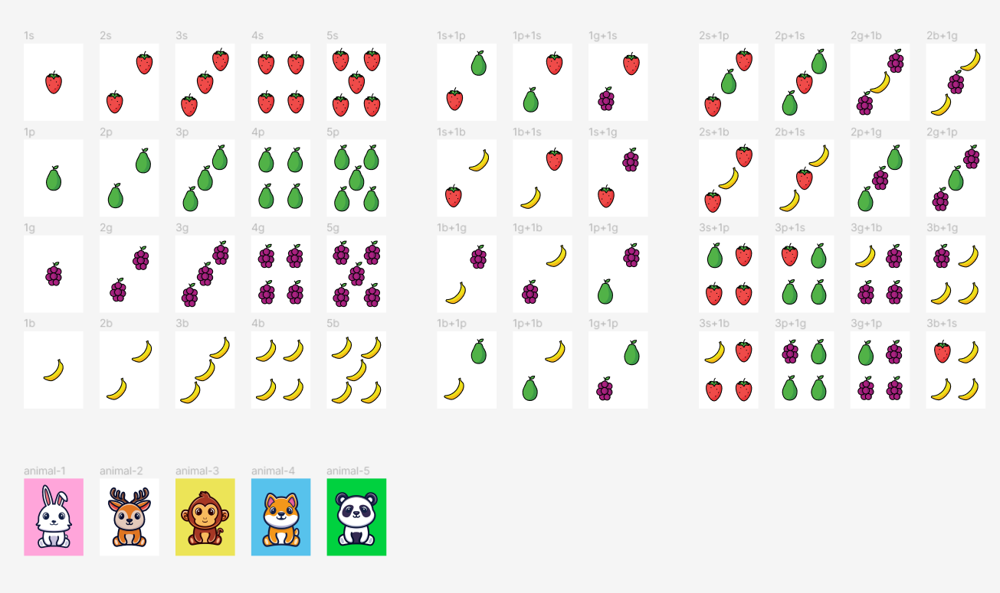

# 《Halli Galli 小游戏机器人》方案设计文档

## 一.  背景

HalliGalli Game（中文译名为德国心脏病游戏）是一款风靡世界的卡牌桌游。随着QQ频道的推广，拟将此游戏线上化，可供任何人将游戏机器人引入自己的频道中，方便朋友们不用面对面也能随时来一局紧张刺激的Halli Galli小游戏。

## 二.  游戏规则

游戏玩家：标准规则 5 人，理论上人数不限

游戏道具：一副 Halli Galli Game 卡牌，一个按铃

游戏卡组由 56 张卡牌构成，分为水果牌和动物牌。水果牌面上含有 1 至 5 个水果（可能是多种水果的组合）；动物牌面上则是一只小动物。卡牌如下图所示：

游戏开始时，将所有卡牌均分给每个参与玩家，正面朝下，玩家不允许查看自己的卡组；将按铃置于桌面中央。从第一位玩家开始，每位玩家依次掀开自己卡组中的一张牌，展示给所有玩家看；当桌面上出现下列情况：

1. 最后掀开的五张牌中恰好含有五个相同水果；
2. 最后掀开的五张牌中含有动物。

则玩家需要抢先按下按铃，第一个按下按铃的玩家赢得本轮，将当前桌面上的所有卡牌洗混并正面朝下收回自己的卡组中，然后进行新的一轮，从上一轮获胜的玩家开始展示卡牌。游戏可以一直进行下去，直到一位玩家手中没有卡牌，无法掀开新牌，则这位玩家淘汰出局。最后一个淘汰出局（或期间得分最高的玩家）获胜。

## 三.  方案设计

### 1. 业务方案设计

根据游戏规则及频道内机器人的功能，拟做出如下简化：

- 将每位玩家翻牌的操作替换为机器人统一发牌，发牌过程即在群中发送图片消息，图片为卡牌卡面图案
- 将“按铃”操作替换为发送@机器人的消息，以消息发送的时间作为抢先按铃的时间
- 将赢下本轮的奖励由获得场上的所有牌简化为赢得一定的奖励分数；将错误按铃的惩罚简化为扣除一定的惩罚分数，在游戏过程中可以随时查看每位玩家的得分（该部分功能待后续版本迭代）

1. 加入频道的能力
2. 在被@到时响应，获取用户发送的消息内容的能力
3. 定时发送主动消息的能力（若主动消息发送数量受限，可改为发送回复用户上一条消息的被动消息）
4. 发送图片消息的能力
5. 存储会话数据，以供后续统计的能力

### 2. 技术方案设计

该项目要求采用 Go 语言实现，拟采用四个协程（gorotine），相互之间通过通道（channel）信号沟通，分别负责如下工作：

1. 主流程负责维持服务主循环，用户发来的interrupt会被中继到此循环中，经由此流程负责终止服务器；
2. 负责接收服务端发来的 socket 事件，根据事件类型执行不同的逻辑：如连接成功后发送鉴权消息、定时器到指定时间时发送心跳；此外，收到用户发送消息事件后，根据事件类型转发给 3 号协程；
3. 持有主游戏流程，维护游戏的状态流转和牌库变化，接受用户发送消息事件，并据此更新游戏状态，产出游戏事件通知转发给 4 号协程；
4. 接受游戏传来的消息事件通知，填充模板并发送对应的机器人消息到频道中。

### 3. 游戏资源设计

采用 Figma 设计所有卡牌样式，并存入图床以便加载：

