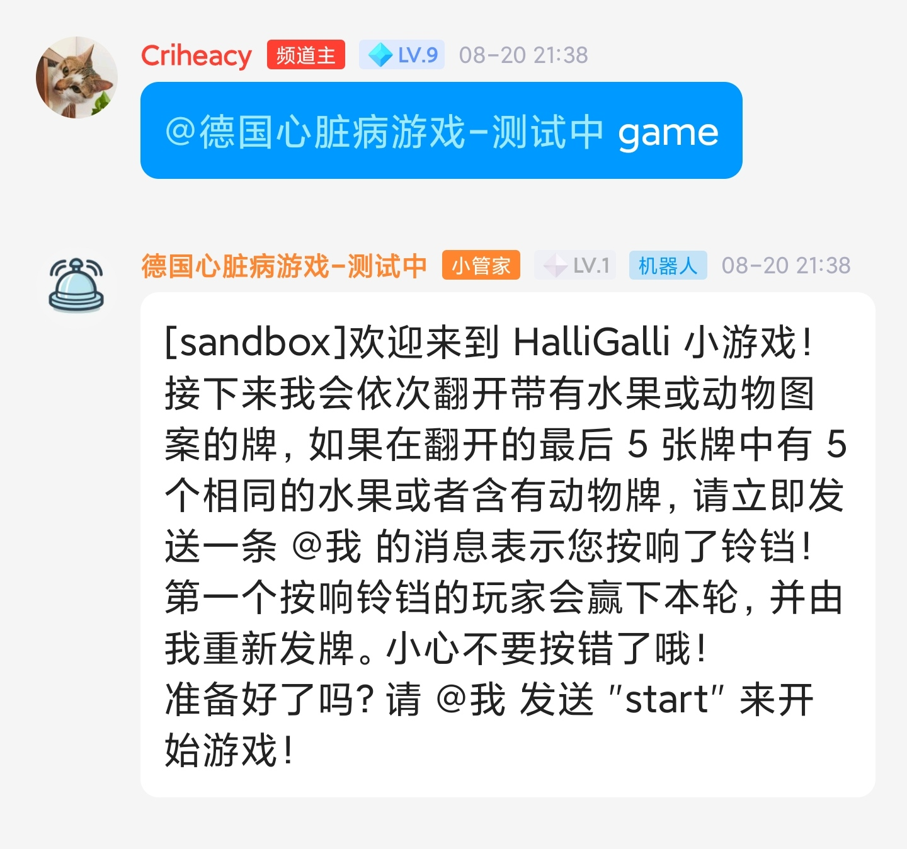
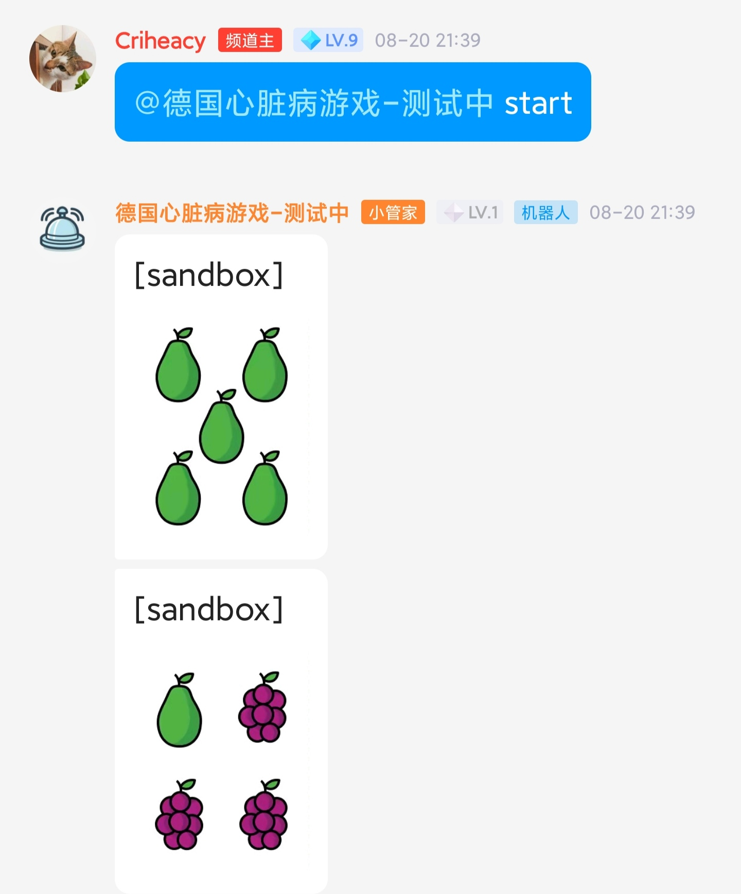
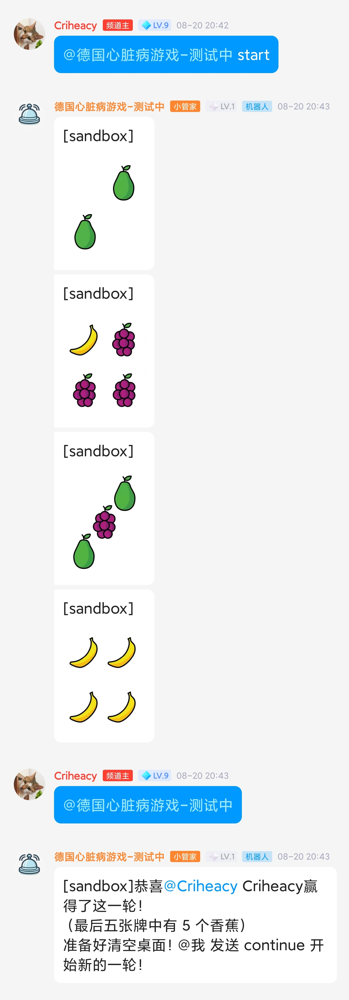
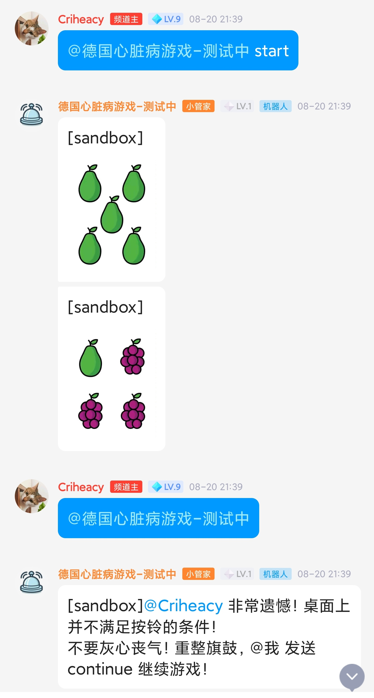
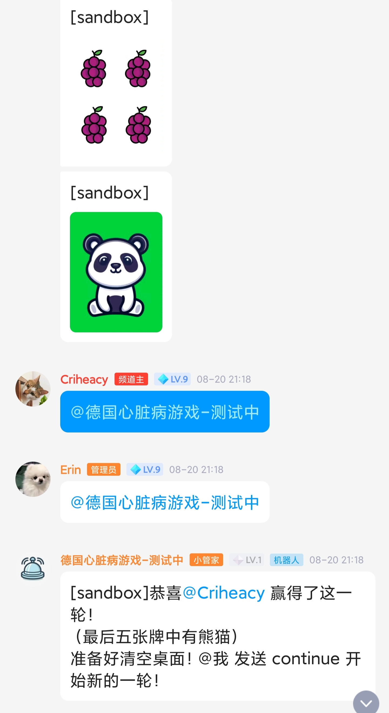
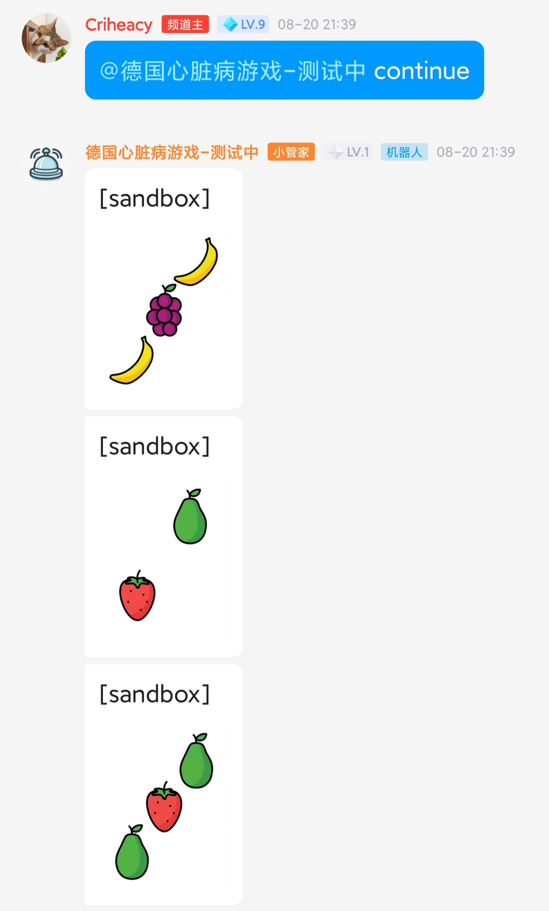
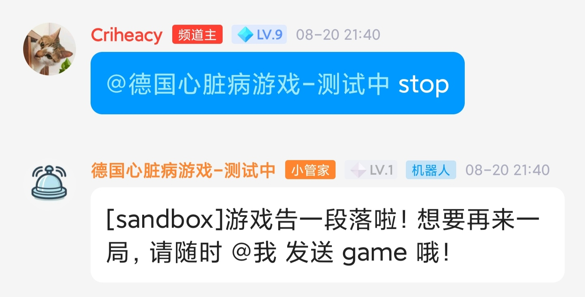

# 《Halli Galli 小游戏机器人》使用说明文档

0. 邀请机器人进入频道

1. @机器人，发送 "game"，机器人会展示游戏规则，并告知用户做好准备开始游戏

   

2. @机器人，"start" 来开始游戏，机器人会每隔五秒钟（可调节）开始发牌：

   

3. 当桌面上出现满足按铃条件的牌时，发送@机器人消息（内容任意）

   

   如果此时不满足按铃条件，则机器人会告知用户按铃失败：

   

   如果有多位用户按铃，则最先按铃的用户胜利：

   

4. 弹出提示后，机器人停止发牌，此时@机器人发送 "continue" 继续游戏：

   

5. 游戏中@机器人发送 "stop" 停止游戏：

   
